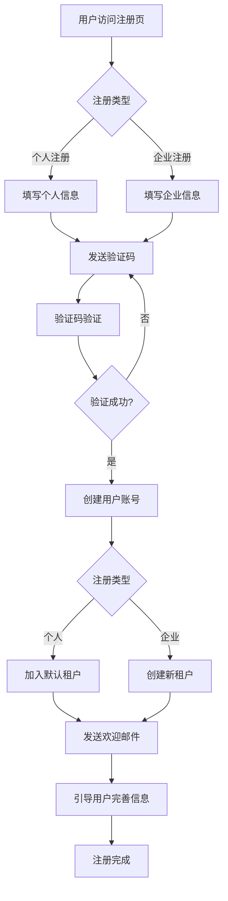

# SaaS系统用户注册登录逻辑改进方案

## 1. 当前问题分析

### 1.1 数据一致性问题 
**问题**: 用户ID字符串与数字ID不一致
- `users.user_id` 是字符串类型 (`user-abc123`)
- `user_tenants.user_id` 是 int64 类型
- 导致租户关联逻辑失效

### 1.2 注册流程不完整
**问题**: 缺少完整的SaaS注册流程
- 没有租户选择/创建逻辑
- 缺少注册后的租户初始化
- 没有邮箱/手机验证流程
- 缺少注册后的引导流程

### 1.3 租户隔离不彻底
**问题**: 多租户数据隔离存在安全风险
- 用户创建时租户ID写死为1
- 缺少租户级别的数据访问控制
- 没有租户间数据隔离验证

## 2. 核心改进方案

### 2.1 用户注册完整流程设计



### 2.2 数据结构改进

#### 统一用户ID体系
```sql
-- 方案1: 全部使用字符串ID
ALTER TABLE user_tenants MODIFY COLUMN user_id VARCHAR(64) NOT NULL COMMENT '用户ID（字符串）';

-- 方案2: 添加映射表
CREATE TABLE user_id_mapping (
    id BIGINT PRIMARY KEY AUTO_INCREMENT,
    string_user_id VARCHAR(64) NOT NULL UNIQUE COMMENT '字符串用户ID',
    numeric_user_id BIGINT NOT NULL UNIQUE COMMENT '数字用户ID',
    created_at DATETIME DEFAULT CURRENT_TIMESTAMP
);
```

#### 增强注册相关表
```sql
-- 注册申请表
CREATE TABLE registration_applications (
    id BIGINT PRIMARY KEY AUTO_INCREMENT,
    email VARCHAR(255) NOT NULL,
    phone VARCHAR(20),
    registration_type ENUM('personal', 'enterprise') NOT NULL,
    company_name VARCHAR(255),
    verification_code VARCHAR(10),
    verification_type ENUM('email', 'phone') NOT NULL,
    status ENUM('pending', 'verified', 'rejected') DEFAULT 'pending',
    expires_at DATETIME NOT NULL,
    created_at DATETIME DEFAULT CURRENT_TIMESTAMP
);

-- 租户邀请表
CREATE TABLE tenant_invitations (
    id BIGINT PRIMARY KEY AUTO_INCREMENT,
    tenant_id BIGINT NOT NULL,
    inviter_user_id VARCHAR(64) NOT NULL,
    invitee_email VARCHAR(255) NOT NULL,
    invitation_code VARCHAR(32) NOT NULL UNIQUE,
    role_id BIGINT,
    status ENUM('pending', 'accepted', 'rejected', 'expired') DEFAULT 'pending',
    expires_at DATETIME NOT NULL,
    created_at DATETIME DEFAULT CURRENT_TIMESTAMP
);
```

### 2.3 新增注册相关API

#### 个人注册流程
```protobuf
// 发起注册申请
message StartRegistrationRequest {
    string email = 1;
    string phone = 2;
    string registration_type = 3; // personal, enterprise
    string company_name = 4; // 企业注册时必填
    string verification_type = 5; // email, phone
}

// 验证注册验证码
message VerifyRegistrationRequest {
    string email = 1;
    string verification_code = 2;
}

// 完成注册
message CompleteRegistrationRequest {
    string email = 1;
    string username = 2;
    string password = 3;
    string nickname = 4;
    string phone = 5;
    string company_name = 6; // 企业注册
    string tenant_name = 7; // 企业注册时的租户名
}
```

#### 租户邀请流程
```protobuf
// 邀请用户加入租户
message InviteUserRequest {
    string email = 1;
    int64 role_id = 2;
    string message = 3;
}

// 接受邀请
message AcceptInvitationRequest {
    string invitation_code = 1;
    string username = 2;
    string password = 3;
    string nickname = 4;
}
```

### 2.4 安全增强

#### 多重验证机制
```go
type RegistrationSecurity struct {
    // 邮箱验证
    EmailVerification bool
    // 手机验证  
    PhoneVerification bool
    // 图形验证码
    CaptchaVerification bool
    // 企业邮箱验证
    CorporateEmailVerification bool
}
```

#### 租户数据隔离
```go
// 中间件：租户数据隔离
func TenantIsolationMiddleware() gin.HandlerFunc {
    return func(c *gin.Context) {
        userID := contextx.UserID(c.Request.Context())
        tenantID := c.GetHeader("X-Tenant-ID")
        
        // 验证用户是否属于该租户
        if !validateUserTenantAccess(userID, tenantID) {
            c.JSON(403, gin.H{"error": "Access denied to this tenant"})
            c.Abort()
            return
        }
        
        // 在上下文中设置租户ID
        ctx := contextx.WithTenantID(c.Request.Context(), tenantID)
        c.Request = c.Request.WithContext(ctx)
        c.Next()
    }
}
```

### 2.5 业务逻辑优化

#### 自动租户创建
```go
func (b *userBiz) RegisterEnterprise(ctx context.Context, rq *apiv1.CompleteRegistrationRequest) error {
    return b.store.TX(ctx, func(ctx context.Context) error {
        // 1. 创建租户
        tenant := &model.TenantM{
            TenantCode: generateTenantCode(),
            Name:       rq.TenantName,
            Status:     true,
        }
        if err := b.store.Tenant().Create(ctx, tenant); err != nil {
            return err
        }
        
        // 2. 创建用户
        user := &model.UserM{
            Username: rq.Username,
            Email:    rq.Email,
            // ... 其他字段
        }
        if err := b.store.User().Create(ctx, user); err != nil {
            return err
        }
        
        // 3. 创建用户-租户关联
        if err := b.store.Tenant().AddUserTenant(ctx, user.UserID, tenant.ID); err != nil {
            return err
        }
        
        // 4. 分配管理员角色
        adminRole := "tenant_admin"
        if err := b.authz.AddRoleForUser(user.UserID, adminRole, tenant.TenantCode); err != nil {
            return err
        }
        
        // 5. 发送欢迎邮件
        b.sendWelcomeEmail(user.Email, tenant.Name)
        
        return nil
    })
}
```

#### 智能登录增强
```go
func (b *userBiz) SmartLogin(ctx context.Context, rq *apiv1.LoginRequest) (*apiv1.LoginResponse, error) {
    // 1. 风险评估
    riskScore := b.assessLoginRisk(ctx, rq)
    
    // 2. 根据风险等级决定验证方式
    if riskScore > 80 {
        // 高风险：需要多重验证
        return b.requireMFALogin(ctx, rq)
    } else if riskScore > 50 {
        // 中等风险：需要验证码
        return b.requireVerificationCodeLogin(ctx, rq)
    }
    
    // 3. 正常登录流程
    return b.normalLogin(ctx, rq)
}
```

## 3. 菜单表设计问题与改进

### 3.1 当前菜单表问题

**问题**: 菜单与权限设计耦合度高
- 菜单表直接包含权限相关字段
- 同一菜单的不同权限难以细化管理
- 权限点与菜单一对一绑定，缺乏灵活性

### 3.2 改进方案：菜单权限分离设计

#### 新的菜单表结构
```sql
-- 菜单表（纯UI结构）
CREATE TABLE menus (
    id BIGINT PRIMARY KEY AUTO_INCREMENT,
    tenant_id BIGINT NOT NULL,
    parent_id BIGINT,
    menu_code VARCHAR(50) NOT NULL,
    title VARCHAR(100) NOT NULL,
    menu_type TINYINT NOT NULL COMMENT '1-目录,2-菜单,3-按钮',
    route_path VARCHAR(255),
    component VARCHAR(255),
    icon VARCHAR(50),
    sort_order INT DEFAULT 0,
    visible TINYINT(1) DEFAULT 1,
    status TINYINT(1) DEFAULT 1,
    created_at DATETIME DEFAULT CURRENT_TIMESTAMP,
    updated_at DATETIME DEFAULT CURRENT_TIMESTAMP ON UPDATE CURRENT_TIMESTAMP,
    deleted_at DATETIME NULL
);

-- 菜单权限关联表（一个菜单可以有多个权限点）
CREATE TABLE menu_permissions (
    id BIGINT PRIMARY KEY AUTO_INCREMENT,
    tenant_id BIGINT NOT NULL,
    menu_id BIGINT NOT NULL,
    permission_id BIGINT NOT NULL,
    is_required TINYINT(1) DEFAULT 0 COMMENT '是否为访问菜单的必需权限',
    created_at DATETIME DEFAULT CURRENT_TIMESTAMP,
    UNIQUE KEY uk_menu_permission (menu_id, permission_id)
);
```

#### 权限表增强
```sql
-- 权限表（独立的权限管理）
CREATE TABLE permissions (
    id BIGINT PRIMARY KEY AUTO_INCREMENT,
    tenant_id BIGINT NOT NULL,
    permission_code VARCHAR(100) NOT NULL,
    name VARCHAR(100) NOT NULL,
    description VARCHAR(500),
    resource_type ENUM('api', 'menu', 'data', 'feature') NOT NULL,
    resource_path VARCHAR(255) COMMENT 'API路径或资源标识',
    action VARCHAR(50) COMMENT '操作类型：view,create,update,delete,export等',
    status TINYINT(1) DEFAULT 1,
    created_at DATETIME DEFAULT CURRENT_TIMESTAMP,
    updated_at DATETIME DEFAULT CURRENT_TIMESTAMP ON UPDATE CURRENT_TIMESTAMP,
    deleted_at DATETIME NULL,
    UNIQUE KEY uk_permission_code_tenant (permission_code, tenant_id)
);
```

### 3.3 菜单权限管理优化

#### 灵活的权限分配
```go
// 为菜单配置权限点
func (b *menuBiz) ConfigureMenuPermissions(ctx context.Context, menuID int64, permissions []MenuPermissionConfig) error {
    return b.store.TX(ctx, func(ctx context.Context) error {
        // 1. 清除现有关联
        if err := b.clearMenuPermissions(ctx, menuID); err != nil {
            return err
        }
        
        // 2. 添加新的权限关联
        for _, perm := range permissions {
            if err := b.addMenuPermission(ctx, menuID, perm); err != nil {
                return err
            }
        }
        
        return nil
    })
}

type MenuPermissionConfig struct {
    PermissionCode string `json:"permission_code"`
    IsRequired     bool   `json:"is_required"`
    AutoCreate     bool   `json:"auto_create"` // 如果权限不存在是否自动创建
}
```

#### 动态菜单权限检查
```go
func (b *menuBiz) GetUserAccessibleMenus(ctx context.Context, userID, tenantID string) ([]*Menu, error) {
    // 1. 获取用户所有权限
    userPermissions, err := b.authz.GetPermissionsForUser(userID, tenantID)
    if err != nil {
        return nil, err
    }
    
    // 2. 获取所有菜单及其权限要求
    menuPermissions, err := b.getMenuPermissionMatrix(ctx, tenantID)
    if err != nil {
        return nil, err
    }
    
    // 3. 过滤用户可访问的菜单
    var accessibleMenus []*Menu
    for _, menu := range menuPermissions {
        if b.checkMenuAccess(menu, userPermissions) {
            accessibleMenus = append(accessibleMenus, menu.Menu)
        }
    }
    
    return accessibleMenus, nil
}
```

## 4. 实施建议

### 4.1 分阶段实施
1. **第一阶段**: 修复数据一致性问题，统一用户ID体系
2. **第二阶段**: 完善注册流程，增加验证机制
3. **第三阶段**: 菜单权限分离重构
4. **第四阶段**: 安全增强和监控完善

### 4.2 向后兼容
- 保留现有API，新增v2版本
- 数据迁移脚本确保平滑升级
- 渐进式重构，避免影响现有业务

### 4.3 监控指标
- 注册转化率
- 登录成功率
- 租户隔离安全事件
- 菜单权限检查性能

这套改进方案将显著提升系统的安全性、可扩展性和用户体验。 